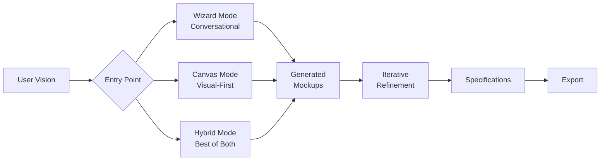

# FlexOS Unified Platform Vision: Evolution to Visual-First Development

## Executive Summary

FlexOS is evolving from a code generation platform to a **visual development environment** that bridges the gap between human vision and technical implementation. This unified vision combines the solid foundation of our conversational wizards (V1) with the paradigm-shifting visual-first approach (V2), creating a platform where users build applications by showing rather than describing.

### Evolution Timeline
- **V1 (Foundation)**: AI-powered code generation through conversational wizards
- **V2 (Visual-First)**: Specification generation from visual mockups and flows
- **Unified**: Both approaches working in harmony, letting users choose their path

## Core Philosophy

### The Fundamental Insight
Users don't need to learn to think like developers - our AI learns to see like users. We extract implicit knowledge from their vision and make it explicit enough for deterministic execution.

### Three Pillars of Development
1. **Visual Truth**: What users see is what drives development
2. **Emergent Patterns**: Design systems emerge from usage, not prescription
3. **Human Language**: Questions match how people think, not how computers work

## Unified Architecture

### Development Modes



### 1. **Wizard Mode** (V1 Foundation)
- Conversational interface for users who prefer guided creation
- Generates initial mockups from descriptions
- Best for: First-time users, complex logic, backend features

### 2. **Canvas Mode** (V2 Innovation)
- Visual-first with immediate mockup manipulation
- AI extracts patterns and specifications from visual elements
- Best for: Designers, visual thinkers, UI-focused development

### 3. **Hybrid Mode** (Unified Approach)
- Start with wizards, refine visually
- Or start visually, add features through wizards
- Best for: Most users after initial learning

## Database Schema Evolution

### Core Tables (Shared Foundation)
```sql
-- Existing tables remain unchanged
users, projects, project_collaborators, wizard_runs, ai_chats

-- Enhanced tables
pages
├── mockup_id (FK → mockups) -- NEW: Current visual state
├── wizard_generated (boolean) -- NEW: Track origin
└── [existing fields...]

features
├── visual_specifications (JSONB) -- NEW: Visual requirements
├── detected_from_mockups (boolean) -- NEW: Emergent features
└── [existing fields...]
```

### New Visual-First Tables
```sql
-- Design system emergence
design_systems
├── id (UUID, PK)
├── project_id (FK → projects)
├── generation_method (prescribed|emergent|hybrid)
├── tokens (JSONB) -- With confidence scores
├── component_patterns (JSONB)
└── user_confirmations (JSONB)

-- Mockup versioning
mockups
├── id (UUID, PK)
├── page_id (FK → pages)
├── version (integer)
├── html_content (text)
├── css_content (text)
├── parent_mockup_id (FK → mockups) -- Version tree
├── change_description (text)
├── ai_extracted_patterns (JSONB)
└── created_by (wizard|user|ai)

-- Visual flow system
journey_flows
├── canvas_state (JSONB) -- VueFlow state
├── flow_type (user|admin|system)
└── [visual flow fields...]

-- Context management
ai_contexts
├── context_type (immediate|local|project|vision)
├── context_data (JSONB)
├── embeddings (vector[1536])
└── relevance_decay (float) -- Context ages
```

## Unified User Journey

### 1. **Project Initialization**
```
Choose Your Path:
┌─────────────────────────────────────┐
│   How do you prefer to start?      │
├─────────────────────────────────────┤
│ 🗣️  Describe it → Wizard Mode      │
│ 🎨  Show it → Canvas Mode          │
│ 🚀  I have mockups → Import Mode   │
└─────────────────────────────────────┘
```

### 2. **Development Flow**

#### Wizard Path:
1. Conversational discovery
2. AI generates initial mockups
3. User reviews and refines visually
4. Patterns extracted for design system
5. Specifications generated

#### Visual Path:
1. Start with mockup/sketch
2. AI identifies elements and patterns
3. User confirms/corrects understanding
4. Features extracted from interactions
5. Specifications generated

#### Hybrid Path:
1. Mix of both approaches
2. Switch modes anytime
3. Context preserved across modes
4. Unified output regardless of path

### 3. **Iterative Refinement**
- Single-change iterations with immediate visual feedback
- Pattern library grows with each decision
- AI learns project-specific conventions
- Context hierarchy maintains coherence

## Context Management System

### Unified Context Structure
```typescript
interface UnifiedContext {
  // Mode-specific context
  mode_context: {
    current_mode: 'wizard' | 'canvas' | 'hybrid'
    mode_history: ModeTransition[]
    preferred_mode: string // learned preference
  }
  
  // Immediate context (what user is working on)
  immediate: {
    wizard_phase?: WizardPhase
    visual_selection?: VisualSelection
    recent_actions: Action[]
  }
  
  // Local context (current work session)
  local: {
    active_page?: Page
    active_flow?: Flow
    pending_changes: Change[]
    conversation_history: Message[]
  }
  
  // Project context (learned patterns)
  project: {
    design_patterns: {
      prescribed: Pattern[] // From wizards
      emergent: Pattern[] // From mockups
      confirmed: Pattern[] // User approved
    }
    behavioral_patterns: string[]
    technical_decisions: Decision[]
  }
  
  // Vision context (overall goals)
  vision: {
    original_statement: string
    refined_understanding: string
    success_criteria: string[]
  }
}
```

## Implementation Roadmap

### Phase 1: Foundation Enhancement (Current → 3 months)
- [x] Basic wizard system
- [x] Authentication and projects
- [ ] Mockup generation from wizards
- [ ] Basic mockup viewer/editor
- [ ] Pattern extraction MVP

### Phase 2: Visual-First Features (3-6 months)
- [ ] Visual flow builder (VueFlow)
- [ ] Mockup versioning system
- [ ] Pattern detection AI
- [ ] Context management system
- [ ] Design system emergence

### Phase 3: Unified Experience (6-9 months)
- [ ] Mode switching with context preservation
- [ ] Hybrid wizards with visual steps
- [ ] Advanced pattern learning
- [ ] Collaborative visual editing
- [ ] Specification generation engine

### Phase 4: Advanced Features (9-12 months)
- [ ] Multi-user visual collaboration
- [ ] AI confidence scoring
- [ ] Custom pattern libraries
- [ ] Export to multiple frameworks
- [ ] White-label capabilities

## Technical Implementation Strategy

### Frontend Architecture
```
/components
├── /wizard         # V1 conversational components
├── /canvas         # V2 visual components  
├── /unified        # Shared/hybrid components
│   ├── ContextManager.vue
│   ├── PatternLibrary.vue
│   ├── ModeSelector.vue
│   └── UnifiedPreview.vue
├── /ai             # AI interaction components
└── /export         # Specification/code export
```

### AI Integration Strategy
1. **Dual Prompt Systems**: Different prompts for wizard vs visual modes
2. **Context Injection**: Mode-aware context building
3. **Pattern Learning**: Feedback loop for improving detection
4. **Confidence Scoring**: AI uncertainty quantification

### Specification Output Format
```yaml
flexos_specification:
  version: "unified-1.0"
  generation_path: "wizard|visual|hybrid"
  
  # What the user wants
  vision:
    original: "Teacher lesson sharing app"
    refined: "Educational content platform with discovery"
    
  # How it should look/feel
  design:
    source: "emergent|prescribed|mixed"
    tokens: {...}
    patterns: {...}
    
  # What it does
  features:
    - name: "Share lesson"
      source: "wizard-defined|visual-detected"
      specifications: {...}
      
  # How it's structured  
  architecture:
    pages: [...]
    flows: [...]
    data_model: {...}
    
  # Implementation details
  technical:
    framework_requirements: [...]
    performance_targets: {...}
    export_ready: true
```

## Success Metrics

### User Success
- **Path Distribution**: 30% wizard, 40% visual, 30% hybrid
- **Mode Switching**: Average 2.5 switches per project
- **Completion Rate**: >85% reach export stage
- **Pattern Reuse**: >60% use emergent patterns

### Platform Success
- **Specification Quality**: 95% implementable without clarification
- **AI Confidence**: Average >0.8 on pattern detection
- **Context Relevance**: 90% of suggestions accepted
- **Export Success**: 100% of specs produce working apps

## Migration Strategy

### For Existing V1 Users
1. Existing wizards continue to work
2. Add "View Mockup" button to wizard outputs
3. Enable visual refinement post-wizard
4. Gradually introduce visual-first features
5. Track preference and adapt UI

### For New Users
1. Show both options at start
2. Recommend based on project type
3. Allow mode switching anytime
4. Learn preferences over time
5. Optimize for their preferred path

## Key Innovations

### 1. **Dual-Path Development**
Users can start with either conversation or visuals, switching freely while maintaining context.

### 2. **Emergent Design Systems**
Instead of choosing from presets, design systems emerge from actual usage patterns.

### 3. **Visual Specifications**
Moving beyond code generation to creating implementation-agnostic specifications.

### 4. **Context Hierarchy**
Sophisticated context management that mirrors human thinking patterns.

### 5. **Confidence-Based AI**
AI that knows what it doesn't know and asks for clarification.

## Conclusion

The unified FlexOS vision represents the best of both worlds: the guidance and structure of conversational wizards with the intuitive power of visual development. By allowing multiple paths to the same destination, we meet users where they are while gently expanding their capabilities.

This evolution maintains our core mission - democratizing app development - while acknowledging that different users think differently. Some prefer to describe, others to show, and many to do both. FlexOS unified accommodates all, learning from each interaction to provide an increasingly personalized and powerful development experience.

The future of development isn't just no-code or low-code - it's **your-code**, built your way, with AI as an intelligent partner that speaks your language, whether that's words, pictures, or both.