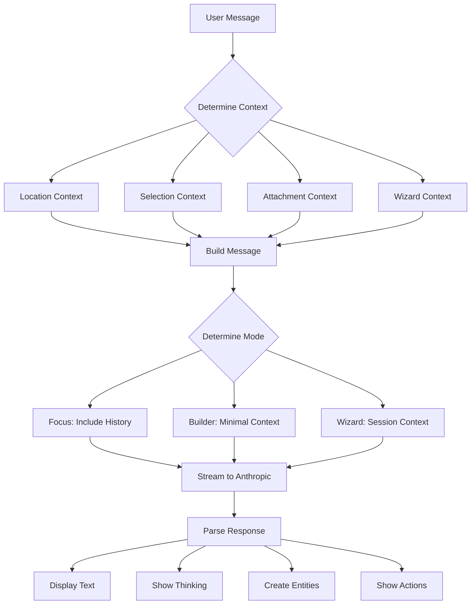

# FlexOS Discovery Chat Architecture Summary

## Core Architecture Decisions

### 1. Message Independence
- **Decision**: Each message is independent, not forced into chronological threads
- **Why**: Users jump between topics naturally
- **Implementation**: Context is explicitly attached, not assumed from history

### 2. Three Chat Modes
- **Focus Mode**: Exploratory, sequential context, no pressure to build
- **Builder Mode**: Task-driven, minimal context, direct actions
- **Wizard Mode**: Guided process, session context, rich interactions

### 3. Context Types
```typescript
type ContextType = 
  | 'selection'    // User selected something in UI
  | 'location'     // Where user is in app
  | 'attachment'   // Uploaded file/URL
  | 'wizard'       // Active wizard session
  | 'reference'    // Explicit reference to entity
```

### 4. Rich Message Types
Beyond text, messages can be:
- **Selections**: Choose from options
- **Comparisons**: Side-by-side choices
- **Forms**: Structured input
- **Visual**: Design previews
- **Thinking**: AI reasoning process

### 5. Streaming Architecture
- Use Anthropic streaming API
- Parse special blocks during stream
- Show thinking process to user
- Create entities in real-time

## Quick Implementation Checklist

### Database Changes
- [ ] Create `chat_messages` table (individual messages)
- [ ] Create `message_outputs` table (created entities)
- [ ] Create `message_actions` table (suggestions/buttons)
- [ ] Create `wizard_sessions` table
- [ ] Update `ai_chats` with mode tracking

### API Endpoints
- [ ] `/api/chat/stream` - Main streaming endpoint
- [ ] `/api/chat/context` - Context gathering
- [ ] `/api/chat/action` - Execute actions
- [ ] `/api/wizard/start` - Begin wizard
- [ ] `/api/wizard/progress` - Update wizard

### Frontend Components
- [ ] `<DiscoveryChat>` - Main container
- [ ] `<ChatModeSwitcher>` - Switch between modes
- [ ] `<StreamingMessage>` - Handle streaming
- [ ] `<ThinkingDisplay>` - Show AI reasoning
- [ ] `<RichMessage>` - Selections, comparisons, etc
- [ ] `<ActionButton>` - Suggested actions
- [ ] `<ContextAttachment>` - Attach context

### Anthropic Integration
- [ ] System prompts for each mode
- [ ] Stream parser for special blocks
- [ ] Entity creation from AI output
- [ ] Action suggestion parser
- [ ] Thinking step extractor

## Key Implementation Files

```
server/
  api/
    chat/
      stream.post.ts      # Main streaming endpoint
      context.get.ts      # Context retrieval
      action.post.ts      # Action execution
  utils/
    anthropic-stream.ts   # Stream parsing
    entity-creator.ts     # Create DB entities
    prompts.ts           # System prompts

components/
  chat/
    DiscoveryChat.vue    # Main component
    ChatMessage.vue      # Message display
    StreamingMessage.vue # Streaming handler
    ChatInput.vue        # Input with context
  messages/
    TextMessage.vue      # Standard text
    SelectionMessage.vue # Choice UI
    ThinkingDisplay.vue  # Reasoning steps
    RichMessage.vue      # Dynamic types

composables/
  useAnthropicStream.ts  # Streaming logic
  useChatContext.ts      # Context management
  useWizardSession.ts    # Wizard state

stores/
  chat.ts               # Chat state
  wizard.ts             # Wizard state
```

## Context Flow



## Example Interactions

### Focus Mode
```
User: "I'm thinking about a marketplace for vintage items"
AI: "That sounds interesting! What draws you to vintage items specifically?"
[Context: Previous focus messages included automatically]
```

### Builder Mode
```
User: "Add a search bar to the homepage"
AI: "I'll add a search bar to your homepage..."
[Creates component, suggests actions]
[Context: Only homepage reference needed]
```

### Wizard Mode
```
User: "Help me create a complete product page"
AI: "I'll guide you through creating a product page. Let's start with..."
[Shows progress checklist, rich interactions]
[Context: Wizard session tracks all decisions]
```

## Performance Considerations

1. **Message Independence**: Faster context loading
2. **Streaming**: Immediate feedback to user
3. **Selective Context**: Only load what's needed
4. **Entity Creation**: Async, doesn't block chat
5. **Action Execution**: Optimistic UI updates

## Security Considerations

1. **Context Validation**: Ensure user owns referenced entities
2. **Action Authorization**: Check permissions before execution
3. **Wizard State**: Validate transitions
4. **API Rate Limiting**: Prevent abuse
5. **Content Filtering**: Sanitize AI outputs

## Next Steps

1. Implement core message schema
2. Build streaming endpoint
3. Create basic chat UI
4. Add context attachments
5. Implement first wizard
6. Add rich message types
7. Polish UX interactions

This architecture provides a flexible, context-aware chat system that can handle natural conversation, direct tasks, and guided processes while creating real project entities.